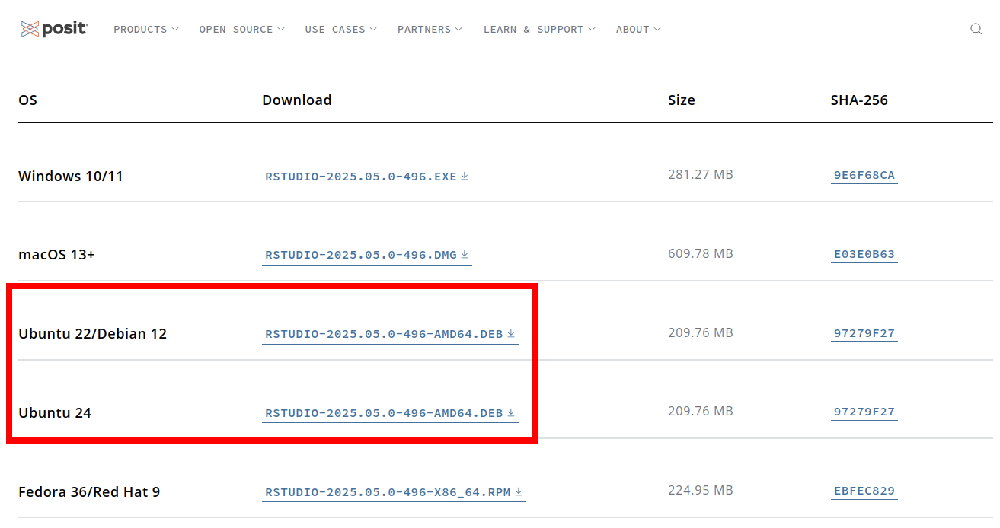

> ⚠️ Atenção
>
> Este guia teve como referência o [guia original de instalação do Modelo LEA](https://github.com/mnunes/modeloLEA), criado por Marcus Nunes
> Além disso, o próprio modelo é de sua autoria.

> ❔ Informação
>
> Este guia ainda está em processo de (lento) desenvolvimento

Este é um guia completo de instalação do Modelo LEA, isto é, considera que sua máquina ainda não tem nenhum pacote/requisito instalado.   
Note que mesmo se sua máquina estiver com algumas partes instaladas, ainda é possível seguir o guia a partir de onde você têm disponível.  

# Instalando o R, RStudio e programas de sistema **necessários**

Mesmo que você já tenha o R e o RStudio instalados, podem haver programas ainda não instalados que são necessários para utilizar o Modelo LEA, logo, se você estiver tendo problemas com a instalação ou a utilização do Modelo LEA, recomendo que leia esta seção.

<details open>
	<summary>Windows (10 e 11)</summary>

Requisitos do sistema (programas que devem estar instalados no sistema para realizar a instalação do RStudio e/ou do Modelo LEA):
- [RTools](https://cran.r-project.org/bin/windows/Rtools/) (programa necessário para compilar pacotes do R)
- [ghostscript](https://ghostscript.com/releases/gsdnld.html) (programa necessário para os slides)

Para instalar o R, RStudio, e o RTools, siga as instruções nos [slides de Tales](source/instalacao_r_rstudio_latex.pdf).

Para instalar o ghostscript, siga as instruções nos [meus slides](source/slides_dia2_modeloLEA.pdf), dos slides 12 ao 18

</details>

<details>
	<summary>Ubuntu, debian, Linux Mint e derivados (Linux, apt)</summary>

> ❔ Informação
>
> ESTA SEÇÃO AINDA ESTÁ SENDO TRABALHADA
  
> ⚠️ Atenção
>
> Com as informações desta seção ainda não é possível instalar o modelo LEA.  
> Não estou tendo sorte tentando instalar via Linux Mint. Logo, esta seção ainda pode mudar gravemente.
  
Para instalar o R, siga os passos, executando os comandos (cada linha separadamente) no terminal:

```{bash}
sudo apt update
sudo apt install software-properties-common dirmngr
```

_O comando acima atualiza os repositórios e instala alguns pacotes de sistema necessários_

```{bash}
sudo apt-key adv --keyserver keyserver.ubuntu.com --recv-keys '95C0FAF38DB3CCAD0C080A7BDC78B2DDEABC47B7'
```

_O comando acima adiciona as credenciais de um repositório específico do R para ubuntu (e derivados)_

```{bash}
wget -qO- https://cloud.r-project.org/bin/linux/ubuntu/marutter_pubkey.asc | sudo tee -a /etc/apt/trusted.gpg.d/cran_ubuntu_key.asc
```

_O comando acima adiciona as credenciais do repositório padrão do R para ubuntu (e derivados)_

```{bash}
sudo add-apt-repository "deb https://cloud.r-project.org/bin/linux/ubuntu $(lsb_release -cs)-cran40/"
```

_O comando acima adiciona o repositório padrão do R para ubuntu_

Agora, pode ser que ainda tenha problemas para instalar o R, então vou dar um passo extra, que consiste em adicionar um repositório específico para sua versão do R.

Para saber qual é a sua versão do ubuntu, rode o comando:

```{bash}
cat /etc/upstream-release/lsb-release
```

A versão do ubuntu tem um codinome,

Se o codinome for noble, rode o comando:

```{bash}
sudo add-apt-repository "deb https://cloud.r-project.org/bin/linux/ubuntu noble-cran40/"
```

Se o codinome for jammy, rode o comando:

```{bash}
sudo add-apt-repository "deb https://cloud.r-project.org/bin/linux/ubuntu jammy-cran40/"
```

Se o codinome for focal, rode o comando:

```{bash}
sudo add-apt-repository "deb https://cloud.r-project.org/bin/linux/ubuntu focal-cran40/"
```

Por fim, atualize o apt novamente desta forma:

```{bash}
sudo apt update --allow-insecure-repositories
```

E então, instale o R, da forma:

```{bash}
sudo apt install r-base r-base-dev
```
  
Para checar a versão do R que foi instalada, rode:

```{bash}
R --version
```

Agora, para instalar o RStudio, abra [este link](https://posit.co/download/rstudio-desktop/), e baixe a versão de acordo com a sua versão do ubuntu, como sinalizado na imagem:  



Clique no link correspondente à sua versão do ubuntu, execute o arquivo baixado, e instale o pacote.  

> ❔ Informação
> 
> Para verificar a sua atual versão do ubuntu, rode o comando no terminal:  
> ```{bash}
> cat /etc/upstream-release/lsb-release
> ```

Para instalar o tidyverse dentro do R, é necessário instalar os pacotes de sistema (pelo terminal do linux):

```{bash}
sudo apt install libcurl4-openssl-dev libfontconfig1-dev libxml2-dev libharfbuzz-dev libfribidi-dev libfreetype6-dev libpng-dev libtiff5-dev libjpeg-dev
```
  
</details>

<details>
	<summary>Fedora RPM (Linux, yum, dnf)</summary>

> ❔ Informação
>
> ESTA SEÇÃO AINDA ESTÁ SENDO TRABALHADA

</details>

<details>
	<summary>Arch (Linux, pacman, yay)</summary>
  
Requisitos do sistema (pacotes que devem estar instalados no sistema para realizar a instalação do RStudio e do Modelo LEA):
 - AUR Helper (como o [yay](https://github.com/Jguer/yay), requisito para facilitar sua vida)
 - GCC-Fortran (requisito para compilar as bibliotecas do R)
 - [ghostscript](https://ghostscript.com/releases/gsdnld.html) (pacote do sistema, requisito para os slides)

A instalação do AUR Helper é de conta sua.  

Para instalar o GCC-Fortran, basta rodar no terminal:

```{bash}
sudo pacman -S gcc-fortran
```

Para instalar o ghostscript, rode no terminal:

```{bash}
sudo pacman -S ghostscript
```

Por fim, para instalar o RStudio (e o R), rode no terminal:

```{bash}
yay -S --noconfirm rstudio-desktop-bin
```

> Note que este comando usa o AUR helper yay (citado anteriormente como um dos pré-requisitos), caso você use outro AUR helper ou ainda não tenha instalado, adapte-se propriamente.

Com isto, o R, RStudio e os pacotes de sistema necessários para instalar o Modelo LEA devem ter sido instalados propriamente, agora prossiga para a instalação do Modelo LEA em si.

</details>

# Instalando o Modelo LEA

**Atenção:** Os seguintes passos consideram que **todos** os passos anteriores do guia estão feitos. **Mesmo que você já tenha o R e o RStudio instalados no seu sistema, existem outros programas que são necessários para utilizar o Modelo LEA que podem não estar**, então, caso esteja tendo problema, tenha certeza que todos os programas mencionados na seção anterior estão instalados.

Os seguintes passos da instalação já serão **executados no console do RStudio**.  

Pré-requisitos do R (RStudio) para instalar a **base** do Modelo LEA:
- tidyverse (necessidade geral)
- tinytex (para compilar o relatório e slides)
- devtools (para importar e compilar o modelo)

No linux, o `tidyverse` precisa de mais um pré-requisito (além do gcc-fortran) para ser compilado corretamente, para instalar esse pré-requisito rode no console do RStudio:

```{r}
install.packages("xml2")
```

Com o pré-requisito instalado, rode no console:

```{r}
install.packages("tidyverse")
```

> O tidyverse é um pacote grande, e como no linux o pacote deve ser compilado, talvez demore um pouco, espere o processo finalizar.

> Se houver erros, rode com o parâmetro `dependencies = TRUE`, ou seja:
> 
> ```{r}
> install.packages("tidyverse", dependencies = TRUE)
> ```

Para instalar o tinytex, rode os comandos (cada linha individualmente):

```{r}
install.packages("tinytex")
tinytex::install_tinytex()
```

É necessário **reiniciar o RStudio** após instalar o tinytex, para ter certeza que foi instalado corretamente.  

> Caso queira checar se a instalação do tinytex foi feita corretamente, rode no console:
> ```{r}
> tinytex::is_tinytex()
> ```
> Caso a instalação tenha sido realizada corretamente, o retorno do comando deve ser `TRUE`, caso contrário, reinstale o tinytex

> Caso o tinytex não tenha sido instalado corretamente (o retorno de `tinytex::is_tinytex()` é `FALSE`), tente reinstalar o pacote pelo gerenciador do R (`install.packages("tinytex", dependencies = TRUE)`) e pelo gerenciador do tinytex, da forma:
> ```{r}
> tinytex::install_tinytex(force = TRUE)
> ```

Para instalar o devtools, rode o comando:

```{r}
install.packages("devtools")
```

Com isto, todos os pré-requisitos para baixar o Modelo LEA estão prontos, e seguiremos para a instalação do modelo.  
Para instalar o modelo LEA, rode no console (cada linha individualmente):

```{r}
library(devtools)
install_github("mnunes/modeloLEA")
```

Com isto o Modelo LEA está instalado e os arquivos já podem ser criados.  

**Porém, o processo de instalação ainda não acabou**. Para compilar o relatório e os slides do Modelo LEA ainda são necessários alguns outros pré-requisitos não necessariamente explicitados, estes são:

- babel-portuges (pacote de linguagem do tinytex, _é realmente digitado portuges_, único requisito para o relatório)
- ggfortify (pacote do r, requisito para slides)
- pdfcrop (pacote do tinytex, requisito para slides)

Para instalar o babel-portuges, rode o comando:

```
tinytex::tlmgr_install("babel-portuges")
```

> Note que este comando usa diretamente o tinytex, logo, tenha certeza que ele foi instalado corretamente (caso este comando acima resulte em erro, releia o trecho sobre o tinytex anterior).

Para instalar o ggfortify, rode o comando:

```
install.packages("ggfortify")
```

Para instalar o pdfcrop, rode o comando:

```
tinytex::tlmgr_install("pdfcrop")
```

> Observação: Para o pdfcrop funcionar corretamente, é necessário instalar o programa ghostscript, caso não tenha instalado, releia a seção de instalação do R, RStudio e programas de sistema **necessários**

Com isso, o Modelo LEA deve ter sido instalado com sucesso e está pronto para a utilização total.
